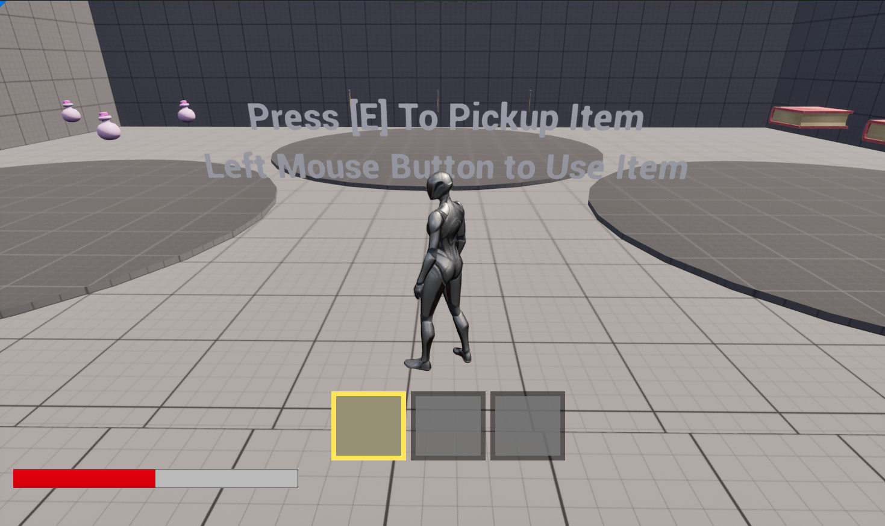
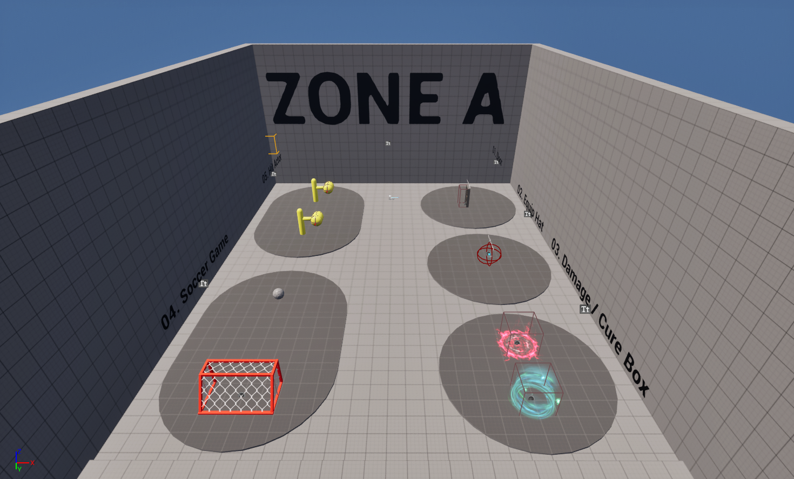
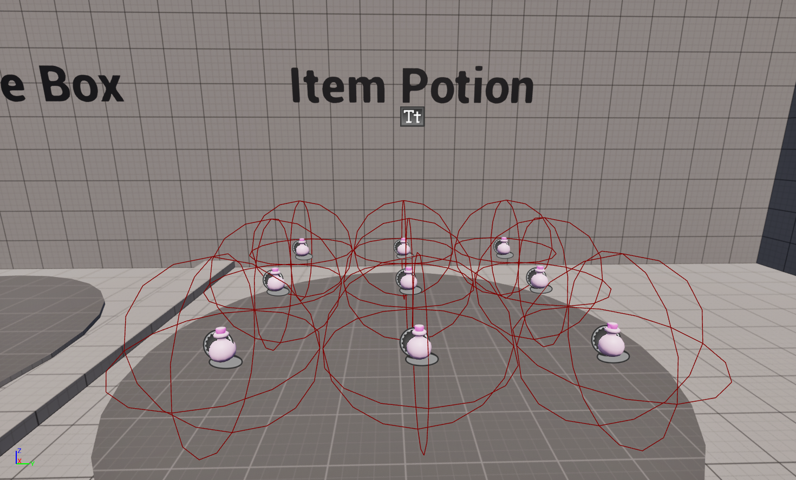
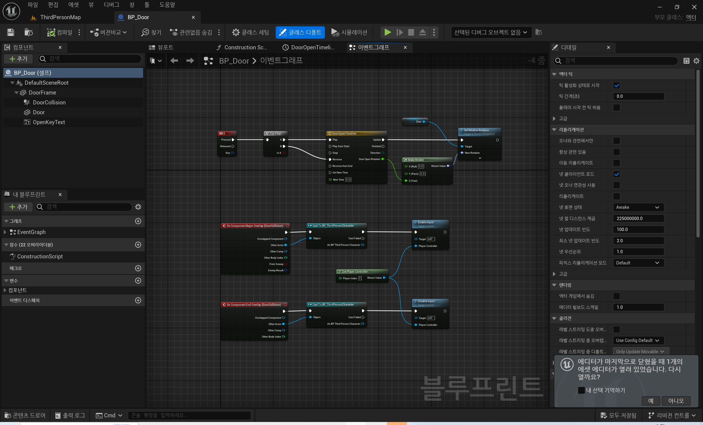
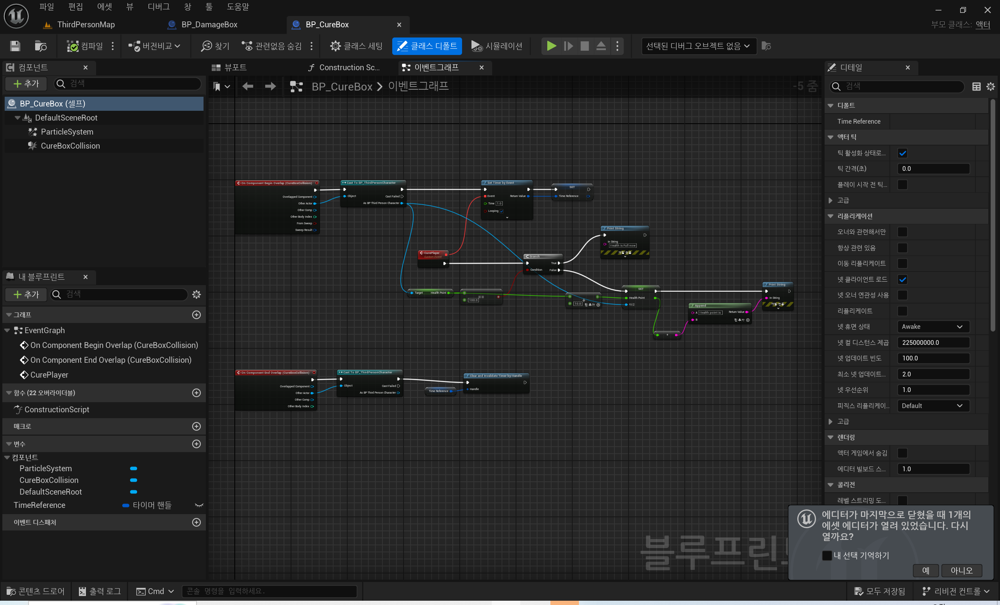
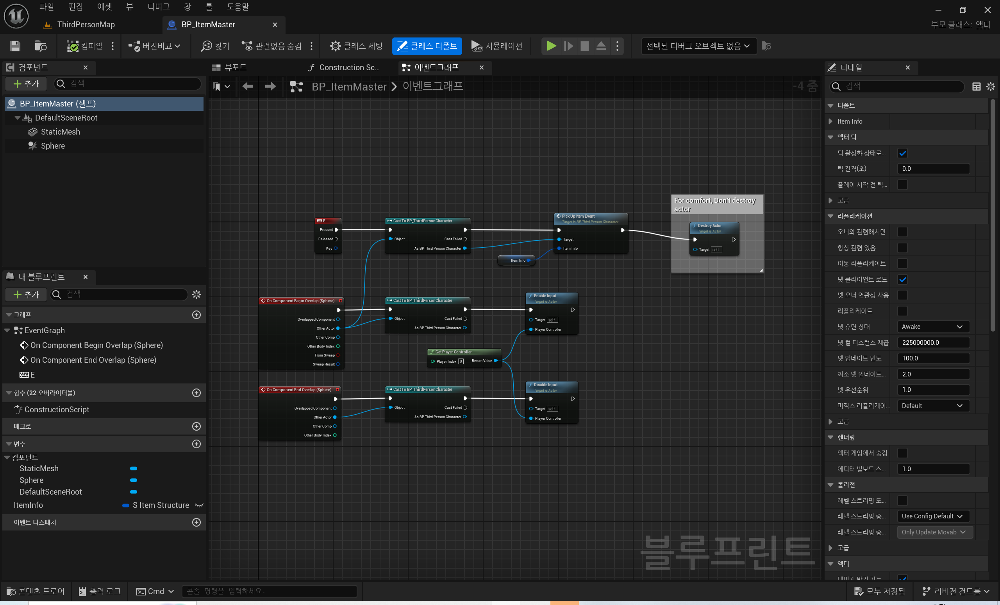

# [UE5 Blueprint] : Unreal Engine Blueprint Study
Unreal Engine 5의 Blueprint를 이용한 비주얼 스크립팅 

 

## 개발 기간: 2024.06. ~ 

 

## 참여 인원: 1인

 

## 개발 환경
- IDE: Unreal Engine v5.3.2
- OS: Windows 10

 

## 참고 자료
  - [[Youtube](https://www.youtube.com/watch?v=Xw9QEMFInYU)] Unreal Engine 5 | Blueprint For Beginners(2023)
  - [[Youtube](https://www.youtube.com/watch?v=cFm4tZqgYvQ)] Unreal Engine 5 | Blueprint For Intermediate Users (2023)
  
 

## 게임 이미지

 

## 블루프린트

 

## 비고
- 블루프린트로 구현된 기능의 Unreal Engine C++로 마이그레이션 하는 작업간 다양한 오류 발생
  - Visual Studio 2022 관련 문제: Visual Stduio Installer의 관련 패키지 설치로 대부분 해결 가능
  - 라이브 코딩 관련 문제: 해결 실패. 라이브 코딩 비활성화시 빌드 가능